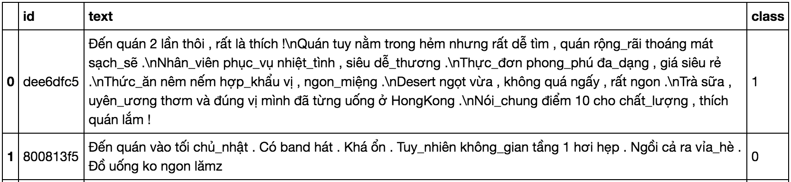
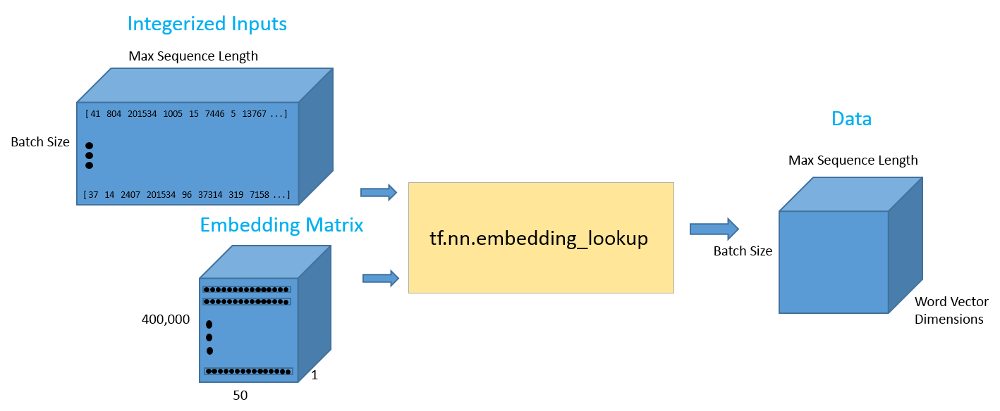
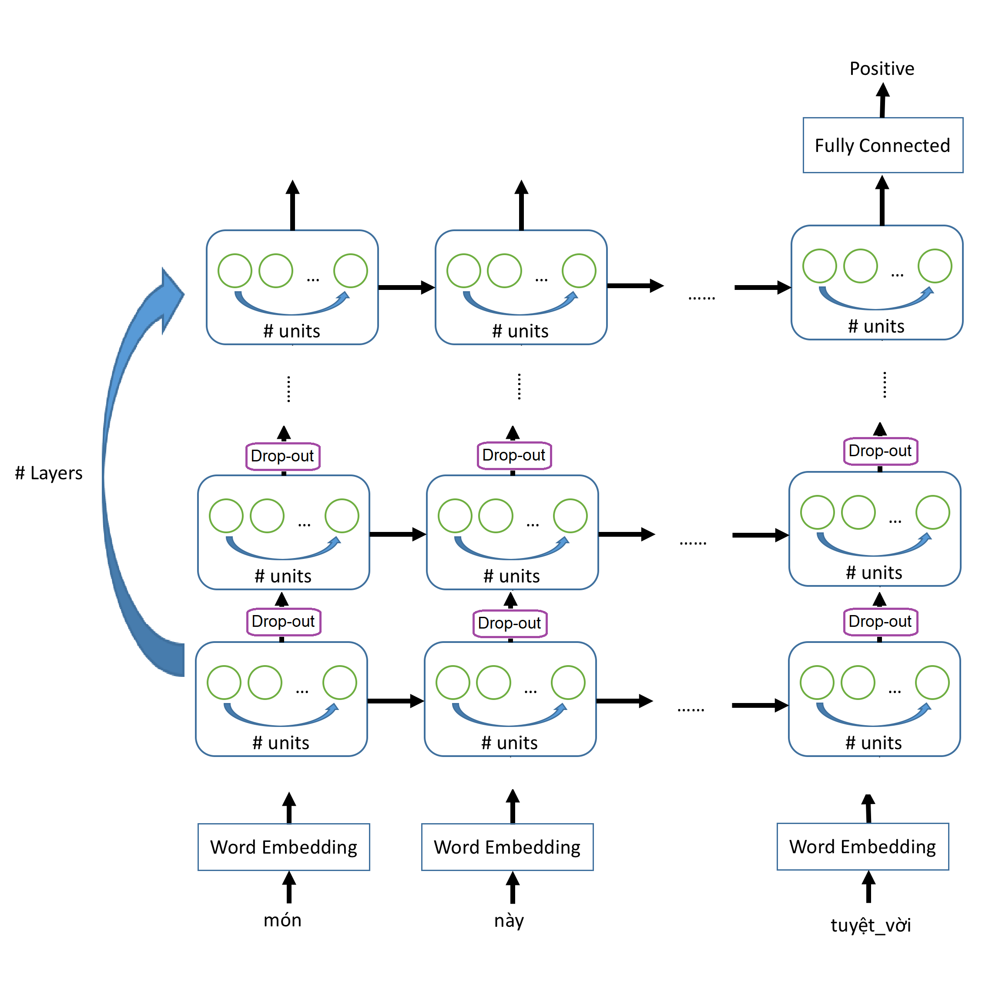
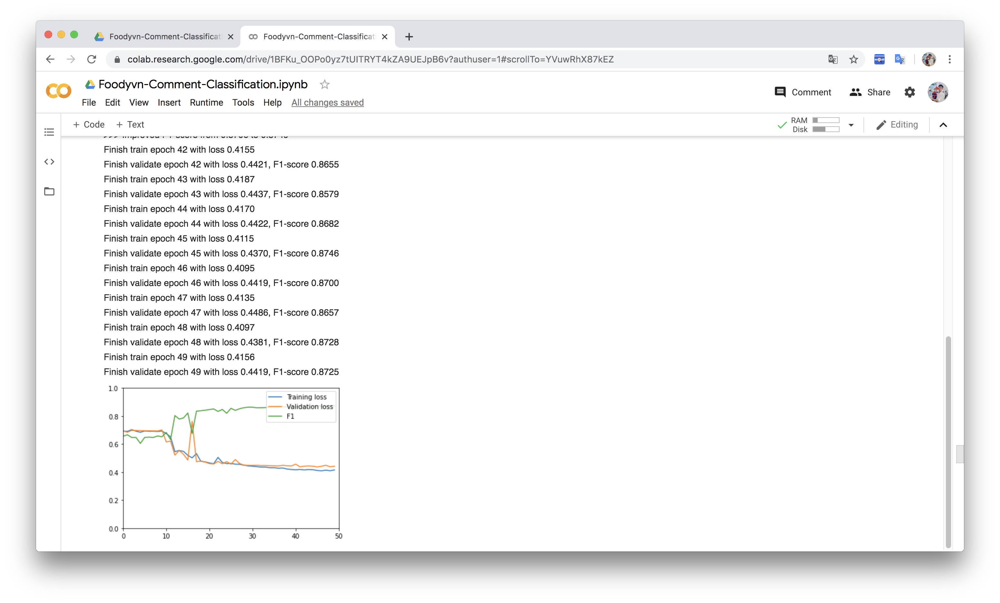
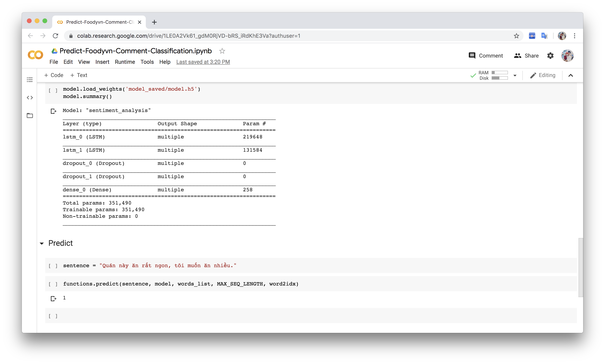

# Foodyvn Comment Classification

The data set for training is taken from the food review website Foody.vn (https://www.foody.vn/). With 2 types of compliments and criticism. The model uses LSTM to predict whether a comment is commendable or not.

Some sample data:



### Data Processing
The process of combining index matrix and word embeddings into data tensor for training is described as shown below:


### Model 

The LSTM network architecture we will use in this exercise is described below. To increase the complexity of the model, we overlap LSTM layers (Stacked LSTM layers). Between the lower LSTM layer and the upper LSTM layer, we place a dropout layer.


### Training

Parameters used:
```python
MAX_SEQ_LENGTH = 230
LSTM_UNITS = 128
N_LAYERS = 2
NUM_CLASSES = 2
```
F1 Score results are about 86%.


### Predict

To make predictions, you can use either file predict.py or file predict on Google Colab.


