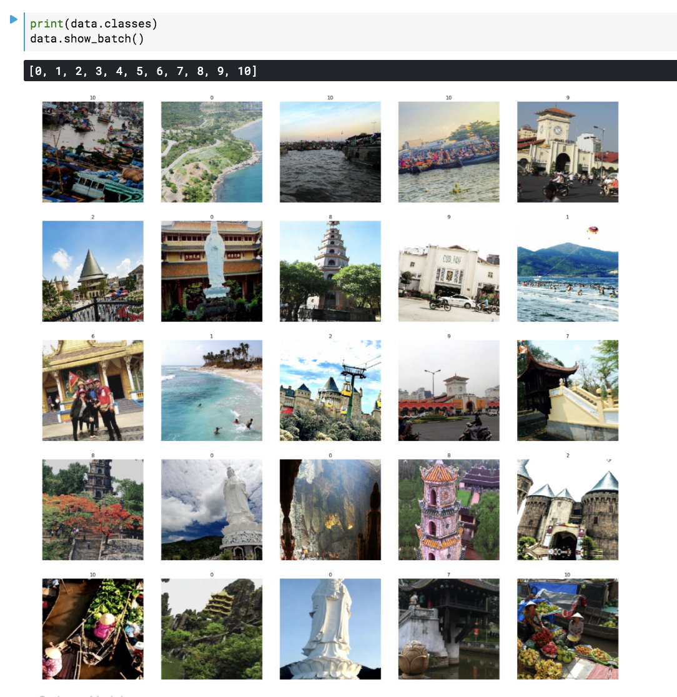
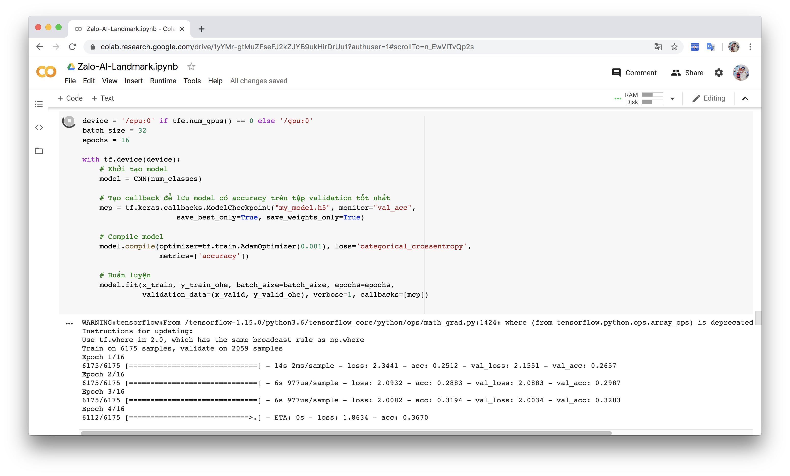
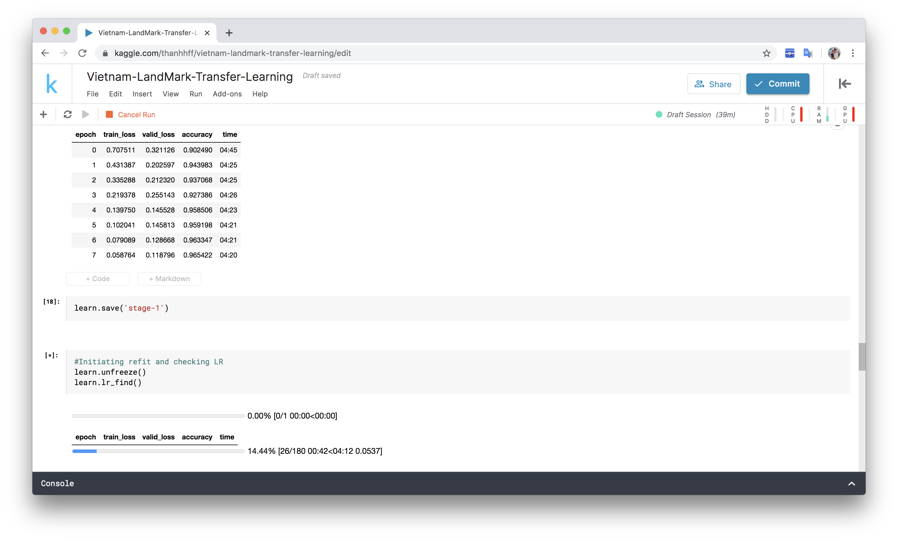
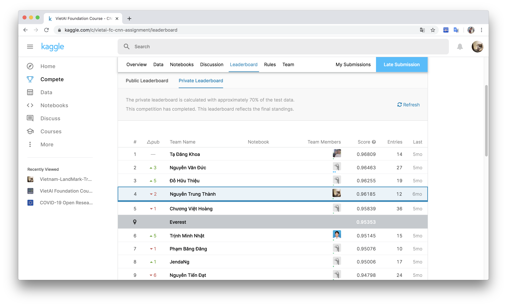

# Project: Using CNN to Detection Vietnam Landmarks

Data are extracted from ZaloAI Landmark detection challenge 2018.

Sample data:

- Training using my model ([Click here](https://github.com/thanhhff/Jobfair-Project/blob/master/Vietnam-Landmarks-Detection/Zalo-AI-Landmark-Training.ipynb)).
Result with **~75%** for detection 11 landmark.

> I use Google Colab for training here.

- Training using **Tranfer Learning**. Use Resnet-152 model.

> I use Kaggle and FastAI Library. 

Result submit at https://www.kaggle.com/c/vietai-fc-cnn-assignment/leaderboard with 96%.

### Detection 

You can try to use your photos to predict (On Google Colab) here: https://github.com/thanhhff/Jobfair-Project/blob/master/Vietnam-Landmarks-Detection/Landmark-Detection.ipynb

### Kaggle Challenge Private Leaderboad with Top 4

